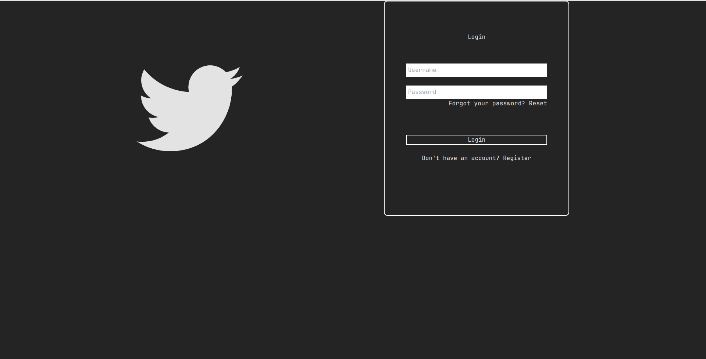
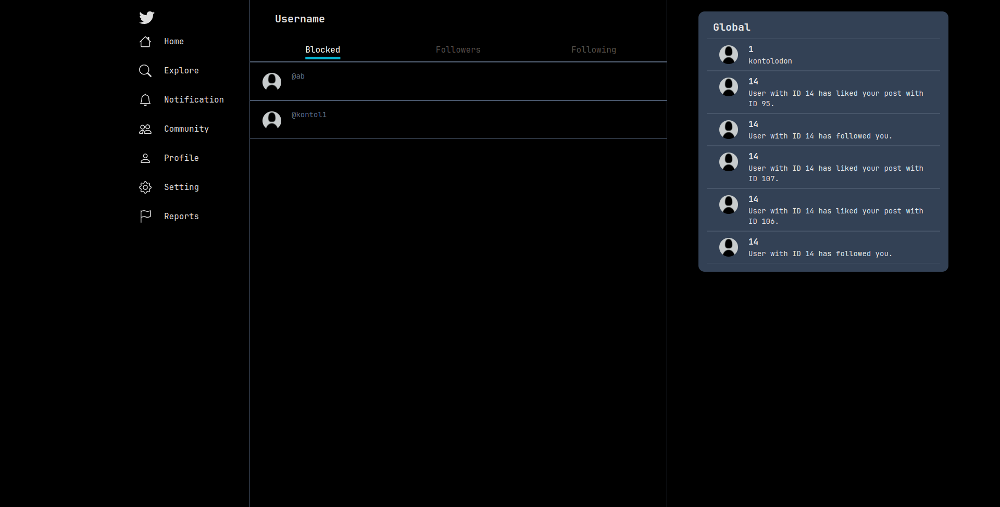

# Twitter Client-Webpage
## Deskripsi singkat
Client-Webpage adalah aplikasi web front-end media sosial layaknya _twitter_ untuk saling berinteraksi antar pengguna dengan membuat _post-post_ yang diperlihatkan secara publik untuk semua pengguna. Pengguna juga dapat mengikuti pengguna lainnya untuk melihat aktivitas yang dilakukan oleh mereka.

## Cara install & run

### Install
1. `https://github.com/frankiehuangg/client-webpage.git`
2. `cd client-webpage`
3. `npm i`

### Run
1. `npm run dev`

## Screenshot Aplikasi
1. 
2. 
3. 
4. 
5. 
6. 
7. 
8. 
9. 
10. 
11. 
12. 
13. 

## Pembagian Tugas

| NIM | Tugas |
|---|---|
| 13521057 | Pembuatan halaman login, register, forget password, post reports, user reports, following, followers, blocked, dan sebagian besar logic handler |
| 13521078 | Halaman lainnya, styling, dan implemen beberapa handler |
| 13521092 | Settings |
